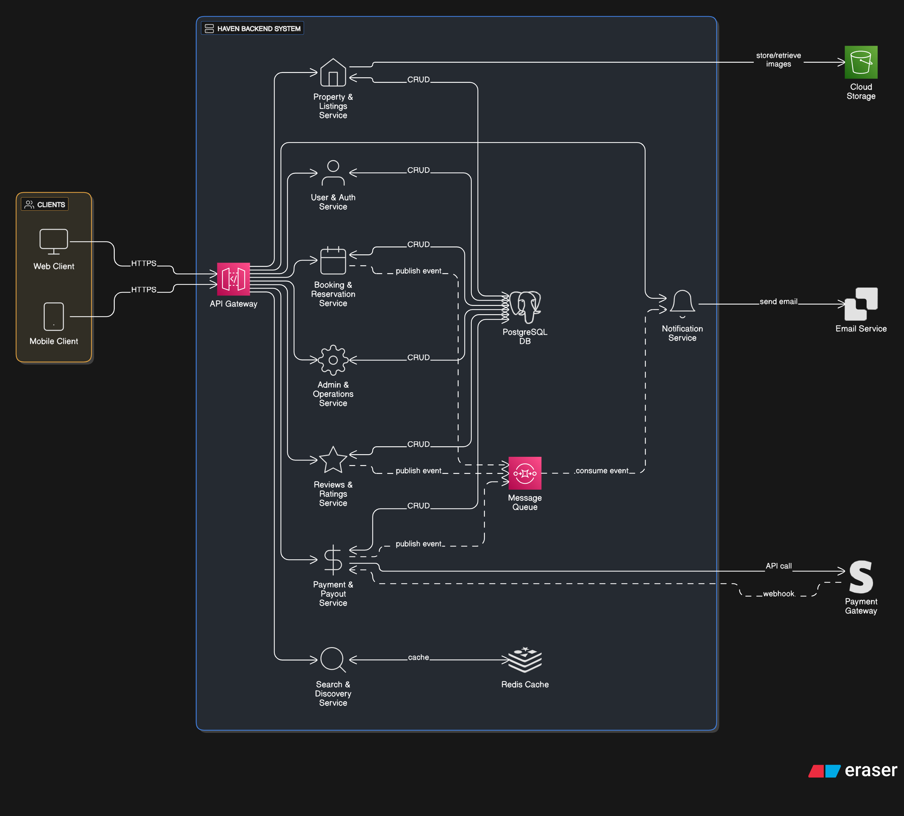

# Airbnb Clone: Backend Architecture

This document provides a high-level overview of the backend architecture for the Airbnb Clone project. The system is designed using a **Service-Oriented Architecture (SOA)** to promote scalability, resilience, and maintainability.

## Architecture Diagram

The following diagram illustrates the logical components, their responsibilities, and the primary interaction flows within the system.

> **Note:** The diagram source file can be opened and edited for free using [app.eraser.io)](https://app.eraser.io/workspace/2fa4z9na8XOWr0riqwnf?origin=share).

## Core Concepts

The architecture is built on a few key principles:

- **API-First Design:** The API Gateway provides a clean, consistent interface for all clients.
- **Domain-Driven:** Each service is organized around a specific business capability (e.g., Bookings, Users).
- **Asynchronous Communication:** A message queue decouples services for non-critical tasks, improving system resilience.
- **Security by Design:** Centralized authentication and clear boundaries protect the system.

---

## Component Breakdown

### 1. API Gateway

The single entry point for all client requests (Web, Mobile). Its responsibilities include:

- **Request Routing:** Directs incoming requests to the appropriate internal service.
- **Authentication:** Validates JWTs for all secured endpoints.
- **Rate Limiting & CORS:** Protects the system from abuse and manages cross-origin policies.

### 2. Core Services

These are the building blocks of our application's logic.

- **User & Auth Service:** Manages user registration, login (email/OAuth), profiles, and roles (`Guest`, `Host`, `Admin`).
- **Property & Listings Service:** Handles the creation, retrieval, updating, and deletion of property listings.
- **Search & Discovery Service:** Provides powerful, filterable search functionality.
- **Booking & Reservation Service:** Manages the entire booking lifecycle, including availability checks and status updates.
- **Payment & Payout Service:** Integrates with Stripe to handle payment processing and host payouts.
- **Reviews & Ratings Service:** Allows guests to review properties after a completed stay.
- **Notification Service:** Sends emails and other notifications based on events in the system.
- **Admin & Operations Service:** Provides an internal dashboard for platform management.

### 3. Shared Infrastructure

The foundational technologies that support the core services.

- **PostgreSQL Database:** The primary relational data store for persistent data (users, properties, bookings, etc.).
- **Redis Cache:** An in-memory data store used for session management and caching frequently accessed data to improve performance.
- **Message Queue (RabbitMQ/SQS):** Enables asynchronous communication between services. For example, the `Booking Service` publishes a `booking_confirmed` event, which the `Notification Service` consumes to send an email.

### 4. Third-Party Services

External dependencies that provide specialized functionality.

- **Cloud Storage (AWS S3):** Stores and serves static assets like user profile pictures and property images.
- **Payment Gateway (Stripe):** Securely processes all financial transactions. Our backend never stores raw payment information.
- **Email Service (SendGrid):** Manages the delivery of all transactional emails.
