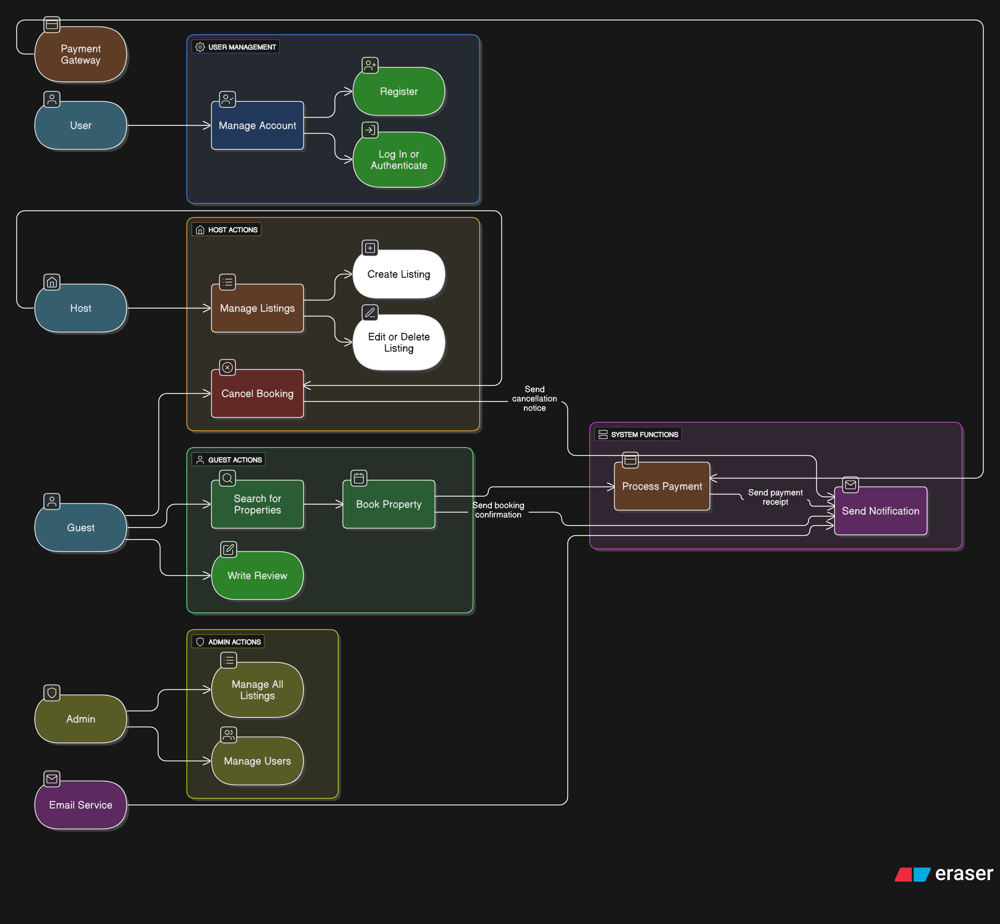

# Use Case Diagram for Airbnb Clone Backend

This document outlines the key user interactions and system functionalities for the Airbnb Clone project, visualized through a UML Use Case Diagram.

## Diagram

## Actors

The primary actors interacting with the system are:

- **Guest:** A user who searches, books, and reviews properties.
- **Host:** A user who lists and manages properties.
- **Admin:** A privileged user responsible for platform oversight.
- **External Systems:** Includes the **Payment Gateway** and **Email Service** which support core functionalities.

## Core User Journeys

The diagram captures the following essential functionalities:

- **User Management:** Account registration and authentication for all users.
- **Guest Experience:** Searching for properties, booking a property (which includes payment), and writing reviews.
- **Host Experience:** Creating, updating, and managing property listings.
- **System Actions:** Processing payments, sending automated notifications, and handling booking cancellations.
